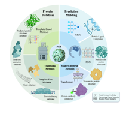

# 🔍 Research Projects

Simple

[project name](https://project.name.com) | 2023.10 – Present
- Presented at American Psychological Association 2024 Convention.
- Explored 5 different personality tests using OpenAI’s large, contextualized embeddings, suggesting new paradigm to analyze psychometric tests.

